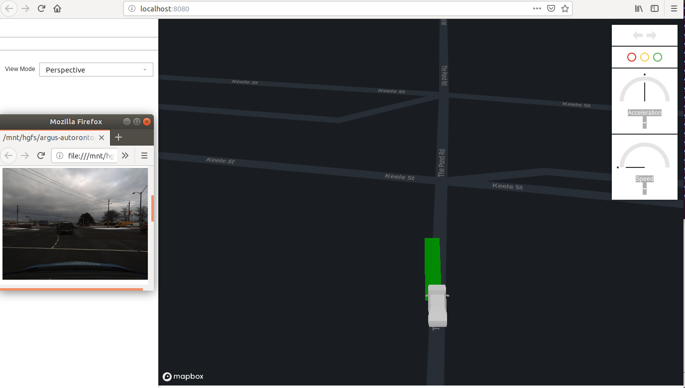

# argus-autoronto
The GUI project for [aUToronto](https://www.autodrive.utoronto.ca/) self driving car, and the course project of team RED for AER1514 Mobile Robotics Winter 2019.

## Team RED
Names in alphabetical order:
- [David Quispe](mailto:david.quispe@mail.utoronto.ca) 
- [John Pineros](mailto:john.pineros@mail.utoronto.ca)
- [Leon Ziyang Zhang](mailto:ziyang.zhang@mail.utoronto.ca)
- [Reid Stevens](mailto:reid.stevens@mail.utoronto.ca)

## System Diagram

Note: we've abandoned a Unity based approach in favor of the following new approach:


Diagram created with [Draw.io](https://www.draw.io/)

## Components:

- [`rosbridge-xviz-connector`](rosbridge-xviz-connector): A data proxy server that read from rosbridge-server and serves data in [XVIZ](https://github.com/uber/xviz) format, which is a opensource protocol from Uber to stream/visualize autonomy data.

- [GUI](gui): A web UI based on Uber's [streetscape.gl](https://github.com/uber/streetscape.gl) which is specialized to visualize data in XVIZ format. Right now we are using the demo example from [streetscape.gl](https://github.com/uber/streetscape.gl/tree/master/examples/get-started) with some minor changes.

- [map-tile-server](map-tile-server): A map tile server that reads local OpenStreemMap data files and serve map vector tiles to the GUI.

## Download our Rosbags:
- [UTIAS testing rosbag](https://drive.google.com/open?id=13JbHYC4Vo3nI2bnJrLPBlyg8jzSQGvCU)
- [Public road rosbag](https://drive.google.com/open?id=1PQoxqT4O00hPmEvyVhkZLWRReAcu2kle)

## Running the Project



1. Follow the steps (1, 2, and 4) in [rosbridge-xviz-connector](rosbridge-xviz-connector) to start the neccessary services.

2. Optionaly, to use our own map tile server, follow the steps in [map-tile-server](map-tile-server).

3. Start the GUI

    Open `gui/dist/index.html` in a browser that support WebGL. Note: if running from a VM, make sure to enable 3D acceleration for it's graphics setting.
    
    By default it will try to connect to servers running in `localhost`. To point to a different server address, simply input the IP or hostname in the `ServerAddr` input box on the left side of the page and click `Re-Connect`.

    By default it uses public mapbox.com for map data. A mapbox access token is needed to properly display the map. Use the `Map Token` input box for changing the token.

    To point to another map tile server, e.g. the one started in step 2, simply change the `Map Style` input box to the `style.json` served by that server, e.g. `http://localhost:10001/styles/osm-bright/style.json`


4. In developement/simulation mode, play the rosbag to start piping in data, e.g.

    ```
    rosbag play autoronto_rosbags/_2018-12-02-12-48-40_m1_tests.bag
    ```

5. After starting the rosbag, if the UI is not updated, refresh the browser window. Since some rosbag recordings are very short, be sensitive to the timing of refresh and play.

## Development

The `gui` folder is a customized version of Uber's streetscape.gl get-started example.

After making changes to its source. Run `yarn build` insude `gui/`. It will generate the new `gui/dist/` bundle.
