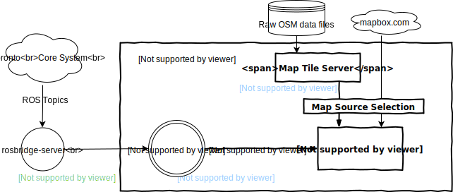

# argus-autoronto
The GUI project for [aUToronto](https://www.autodrive.utoronto.ca/) self driving car, and the course project of team RED for AER1514 Mobile Robotics Winter 2019.

## Team RED
Names in alphabetical order:
- [David Quispe](mailto:david.quispe@mail.utoronto.ca) 
- [John Pineros](mailto:john.pineros@mail.utoronto.ca)
- [Leon Ziyang Zhang](mailto:ziyang.zhang@mail.utoronto.ca)
- [Reid Stevens](mailto:reid.stevens@mail.utoronto.ca)

## System Diagram

## Components:

- ROS connector: the C++/C# interface that read data from ROS topics and send over to the Unity C# runtime.

- Map Rendering: read map data from disk or online service and render an image based on the input GPS location.

- Unity:
  - Main rendering loop: read data from the first 2 components and render the following data:
    - 3D point cloud
    - lane detection result
    - obstacle detection result
    - map image in a window (might be expandable)
  - Configuration: read in a config file (or with a button in the UI to set config at runtime) to choose which subset of data to render, size of the window etc.